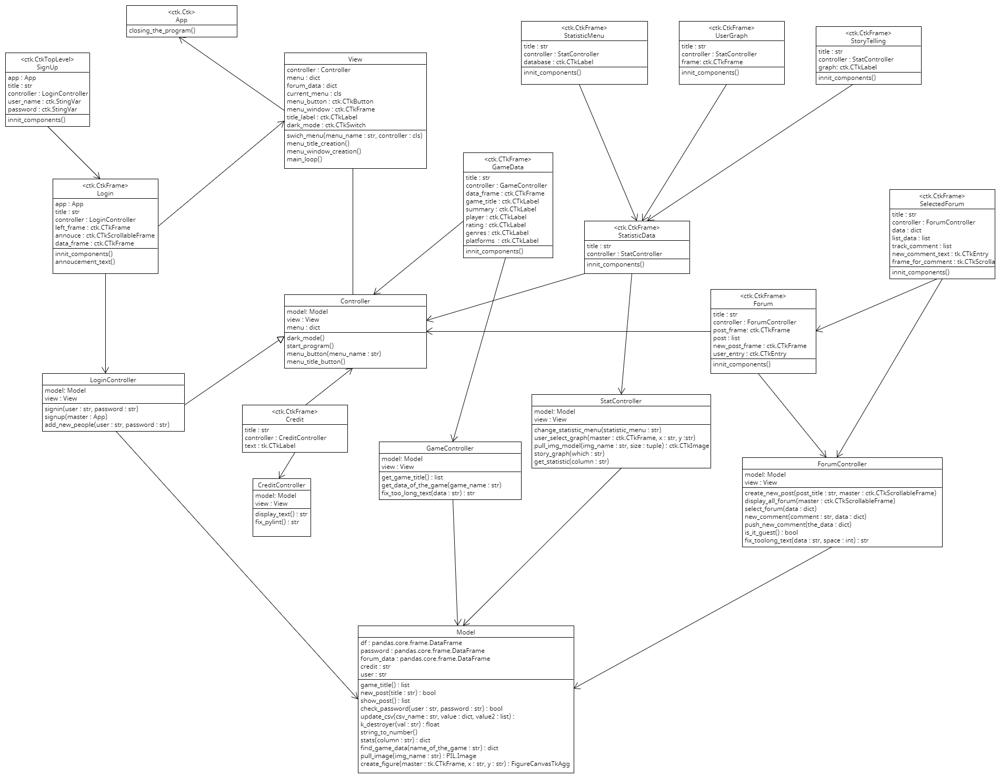
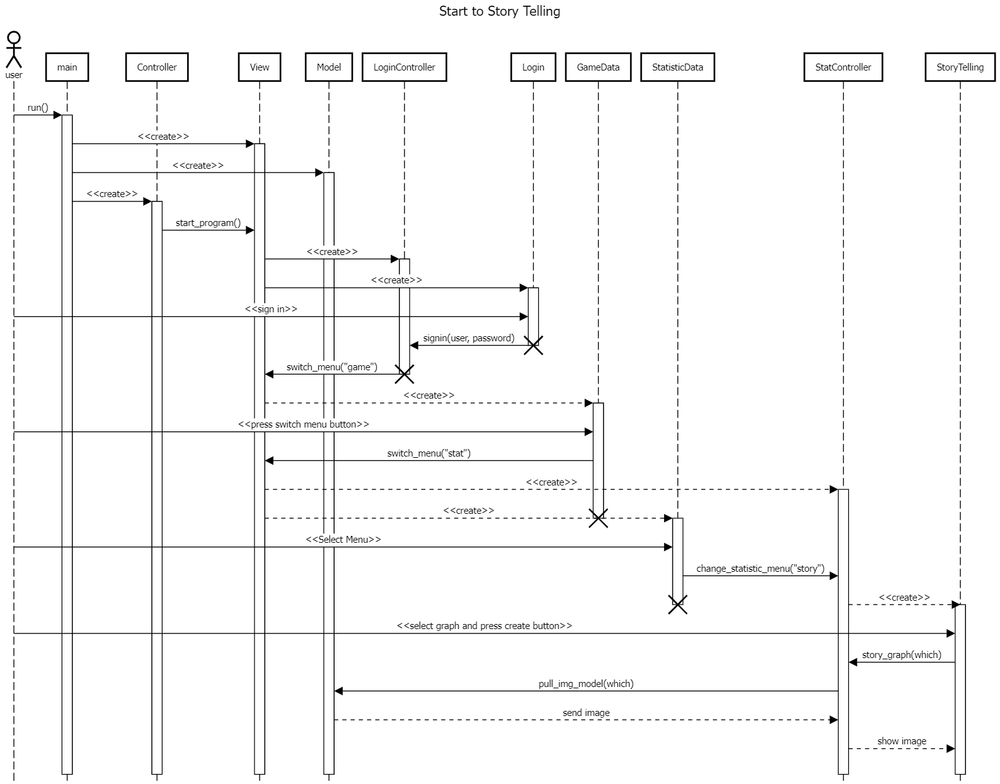

# The Game Rating Predictor A Star Seeker's Guide
This project is my year 1 final project for the Programming II course at Kasetsart University.
The reason why I made this project is I want to make a program that is a platform for Game Developers to discuss and share their ideas to make their game better and achieve higher score ratings from players. 

# Main Features
 * **See the statistics of each game**
      - **The user can see the relationship between each factor that affects the Rating score.**
 
      - **The user can create a graph to see the relationship between other factors.**
 
 
 * **See the data of 20000++ games**
     - **The user can select the game's title to see the data of that game. For example, Rating Score, Total Players, Summary of the game.**
 
 
* **Talk with each other**
    - **The users can create a forum to ask or give their ideas to other game developers.**

# Requirements
Requires Python 3.11 and Python Packages that are listed in [requirements.txt](./requirements.txt).

# Database
My database comes from [Popular Video Games 🎮🕹️](https://www.kaggle.com/datasets/matheusfonsecachaves/popular-video-games?resource=download)

# UML Class Diagram

# UML Sequence Diagram

#### Program from start to Storytelling

## Installation Guide
1. Clone the project
> git clone https://github.com/Ichi1234/The_Game_Rating_Predictor.git

2. Navigate to the project directory
> cd The_Game_Rating_Predictor

3. Install the requirements.txt
> pip install -r requirements.txt

4. Run the project
> python main.py
